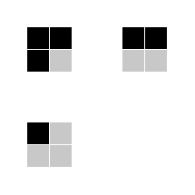
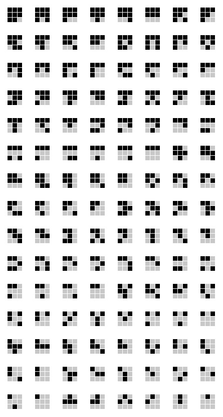

# Directional Planar Marker Generator
This project examines the number of possible planar markers in n by n black and white array form, which do not have ambiguity in the determination of the orientation.

Each of the generated markers can be saved in "PGM" file, as well as the whole dictionary.

The dictionary for 2 by 2 markers are relatively simple:

However, the figure below shows an example 3 by 3 dictionary generated by this program.

